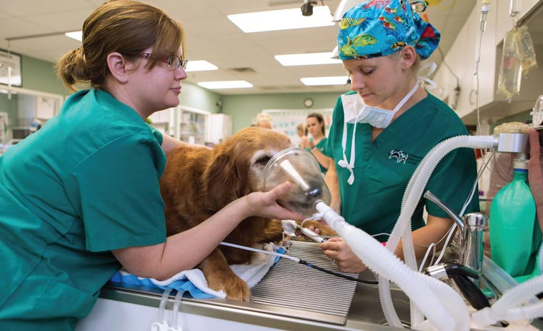

# Vet Scientia

Vet Scientia is a web-based veterinary simulation platform for practicing clinical decision-making before entering the clinic. The application gives students, teachers, and administrators role-specific tools for managing courses, assignments, simulation access, performance review, and discussion workflows.

{ .home-hero-image }

Use the navigation above to open the user guide, deployment guide, troubleshooting notes, or role-specific documentation.
